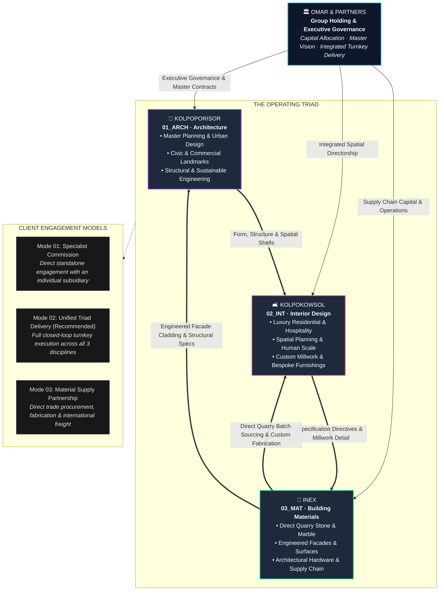

<div align="center">

# OMAR & PARTNERS

### Premier Architecture, Interior Design & Advanced Building Materials Holding Group

[](https://nextjs.org/)
[](https://reactjs.org/)
[](https://www.typescriptlang.org/)
[](https://tailwindcss.com/)
[](https://motion.dev/)
[](./LICENSE)

<p align="center">
  A state-of-the-art enterprise digital platform representing <strong>Omar & Partners</strong> and its tripartite ecosystem of specialized subsidiaries: <strong>Kolpoporisor</strong> (Architecture), <strong>Kolpokowsol</strong> (Interior Design), and <strong>INEX</strong> (Building Materials).
</p>

</div>

---

## 🏛️ Executive Summary

**Omar & Partners** is a multi-disciplinary holding group orchestrating the built environment across concept, spatial realization, and material supply. By converging three autonomous yet seamlessly integrated operating companies under unified group governance, the enterprise delivers end-to-end turnkey projects with zero fragmentation between architectural design, interior fit-out, and global supply chain logistics.

---

## 🌐 The Company Ecosystem

The group operates on a **Unified Triad Model**—where architectural structure, interior environments, and material intelligence reinforce one another in a synchronized closed loop:



---

## 🏢 Operating Entities Matrix

| Entity | Code | Primary Discipline | Scope & Capabilities | Portal Route |
| :--- | :--- | :--- | :--- | :--- |
| **Omar & Partners** | `O&P` | **Holding Group** | Executive strategy, cross-entity coordination, capital allocation, unified contracts | [`/`](./app/page.tsx) |
| **Kolpoporisor** | `01_ARCH` | **Architecture** | Master planning, urban architecture, institutional & residential towers, civic infrastructure | [`/kolpoporisor`](./app/kolpoporisor) |
| **Kolpokowsol** | `02_INT` | **Interior Design** | High-end hospitality fit-outs, corporate interiors, bespoke furniture, lighting curation | [`/kolpokowsol`](./app/kolpokowsol) |
| **INEX** | `03_MAT` | **Building Materials** | Direct quarry stone sourcing, facade engineering, architectural hardware, worldwide logistics | [`/inex`](./app/inex) |

---

## ⚡ Key Technical Features

- **Next.js 16 (Turbopack & App Router)**: Blazing-fast static generation, edge rendering, and optimized resource caching.
- **Tailwind CSS v4 & Theming**: Next-generation PostCSS-driven CSS styling with dynamic entity-level theming and contrast-compliant palettes.
- **Cinematic Motion**: Smooth hardware-accelerated animations, scroll-triggered reveals, and micro-interactions powered by `motion/react`.
- **Bento Capabilities Grids**: Responsive capability showcases highlighting stats, awards, project galleries, and specs.
- **Full Legal & Governance Suite**: Ready-to-deploy accessibility, GDPR cookie policy, terms, and privacy protocols.
- **100% Type-Safe**: Strict TypeScript architecture for routes, data models, and UI primitives.

---

## 📂 Project Structure

```text
omarandpartners/
├── app/                               # Next.js App Router root
│   ├── about/                         # Group philosophy, history & leadership
│   ├── brands/                        # Material partners & brand alliances
│   ├── careers/                       # Group career opportunities & postings
│   ├── companies/                     # Complete subsidiary ecosystem showcase
│   ├── contact/                       # Global headquarters inquiry & consultation
│   ├── inex/                          # INEX Building Materials portal
│   ├── insights/                      # Articles, news & press releases
│   │   ├── articles/
│   │   ├── news/
│   │   └── press-releases/
│   ├── kolpokowsol/                   # Kolpokowsol Interior Design portal
│   │   ├── overview/                  # Division capabilities
│   │   ├── projects/                  # Portfolio & dynamic project details [id]
│   │   └── services/                  # Interior design service packages
│   ├── kolpoporisor/                  # Kolpoporisor Architecture portal
│   │   ├── overview/                  # Architectural practice overview
│   │   ├── projects/                  # Landmark projects & case studies [id]
│   │   └── services/                  # Architectural services & master planning
│   ├── legal/                         # Compliance, privacy, terms & accessibility
│   ├── teams/                         # Principals, partners & specialist roster
│   ├── globals.css                    # Tailwind CSS v4 design tokens & base rules
│   ├── layout.tsx                     # Root HTML shell & meta configuration
│   └── page.tsx                       # Group landing page & cinematic hero
├── components/
│   ├── features/                      # Domain-specific interactive widgets
│   │   └── landing/hero-cinematic.tsx # Cinematic hero section with interactive media
│   ├── layout/                        # Navigation header, mobile menu, footer, theming
│   └── ui/                            # Reusable design system primitives (Bento, Grids, Buttons)
├── config/
│   └── site.ts                        # Master navigation, metadata & company configuration
├── public/                            # High-resolution architectural photography, logos & assets
├── LICENSE                            # MIT License
└── package.json                       # Project dependencies & runtime scripts
```

---

## 🚀 Getting Started

### Prerequisites

- **Node.js**: v18.18+ or v20+ recommended
- **pnpm**: v8+ or v9+ (or `npm` / `yarn` / `bun`)

### 1. Clone the Repository

```bash
git clone https://github.com/IFTE-13/omarandpartners.git
cd omarandpartners
```

### 2. Install Dependencies

```bash
pnpm install
```

### 3. Start the Development Server

```bash
pnpm run dev
```

Open [http://localhost:3000](http://localhost:3000) in your browser to view the holding group portal.

### 4. Build for Production

```bash
pnpm run build
```

To test the production build locally:

```bash
pnpm run start
```

---

## 📄 License

This project is open source and available under the terms of the [MIT License](./LICENSE).

Copyright © 2026 **Omar & Partners**. All rights reserved.
